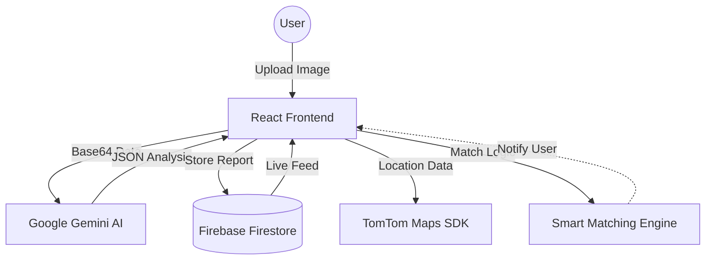

# CampusFind 🔍

[](https://react.dev/)
[](https://firebase.google.com/)
[](https://ai.google.dev/)
[](https://developer.tomtom.com/)
[](https://opensource.org/licenses/MIT)

**CampusFind** is a sophisticated, AI-enhanced platform designed to solve the age-old problem of lost items on university campuses. By merging real-time geolocation with multimodal AI, we provide a seamless bridge between lost belongings and their rightful owners.

---

## 🚀 Live Demo
**Access the platform**: [https://campusfind-7a340.web.app](https://campusfind-7a340.web.app)

---

## 💡 The Problem
Traditional lost-and-found systems are often fragmented, relying on physical boxes or disorganized social media groups. Items are frequently mislabeled, locations are vague, and matching owner to item is a manual, inefficient process.

## ✨ Our Solution: The Intelligent Campus Network
CampusFind transforms the recovery process into a streamlined digital experience:

- **📸 Multimodal AI Analysis**: Using **Google Gemini 1.5 Flash**, the app automatically analyzes photos of found items to generate titles, detailed descriptions, and categories. No more tedious manual entry.
- **📍 Precision Geolocation**: Powered by **TomTom Maps**, users can pinpoint exactly where an item was found, providing spatial context that increases recovery rates.
- **🤖 Smart Matching Engine**: Our backend doesn't just store reports; it actively compares "Lost" and "Found" entries using AI to suggest potential matches, proactively connecting users.
- **🔐 Verified University Ecosystem**: Integrated with **Firebase Authentication (Google Sign-In)**, ensuring all reports are accountable and tied to university-verified identities.
- **📱 Responsive Community Feed**: A real-time dashboard with advanced filtering and search capabilities, built for speed and accessibility.

---

## 🏗️ Architecture & Data Flow



---

## 🛠️ Technology Stack

| Layer | Technology |
| :--- | :--- |
| **Frontend** | React 19, TypeScript, Vite, Tailwind CSS |
| **Backend & Auth** | Firebase (Auth, Firestore, Hosting) |
| **AI Integration** | Google Generative AI (Gemini 1.5 Flash) |
| **Geospatial** | TomTom Maps Web SDK |
| **UI Components** | Lucide React Icons |

---

## 🚀 Getting Started

### Prerequisites
- Node.js (v18+)
- Google AI Studio API Key ([Gemini](https://aistudio.google.com/))
- Firebase Project setup
- TomTom Developer Key ([TomTom](https://developer.tomtom.com/))

### Installation

1.  **Clone the Repo**
    ```bash
    git clone https://github.com/Icey067/CampusFind.git
    cd CampusFind
    ```

2.  **Install Dependencies**
    ```bash
    npm install
    ```

3.  **Environment Setup**
    Create a `.env.local` in the root:
    ```env
    VITE_FIREBASE_API_KEY=your_key
    VITE_FIREBASE_AUTH_DOMAIN=your_project.firebaseapp.com
    VITE_FIREBASE_PROJECT_ID=your_project_id
    VITE_GEMINI_API_KEY=your_key
    VITE_TOMTOM_API_KEY=your_key
    ```

4.  **Launch Development**
    ```bash
    npm run dev
    ```

---

## 🛣️ Roadmap
- [ ] **Push Notifications**: Real-time alerts when a smart match is found.
- [ ] **Verified Pickup**: QR-code based handoff system to verify item return.
- [ ] **Predictive Hotspots**: Heatmaps of where items are most commonly lost.
- [ ] **Multi-Campus Support**: Scaling the infrastructure for multiple universities.

---

*Developed for the TechSprint Hackathon. Empowering campus communities through technology.*
